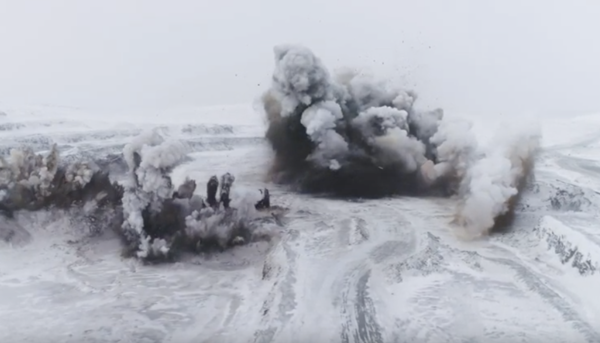
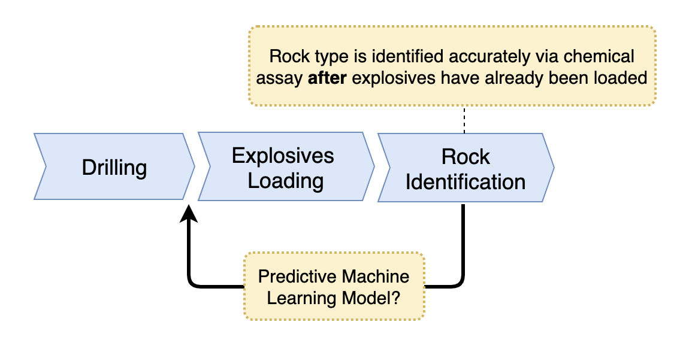
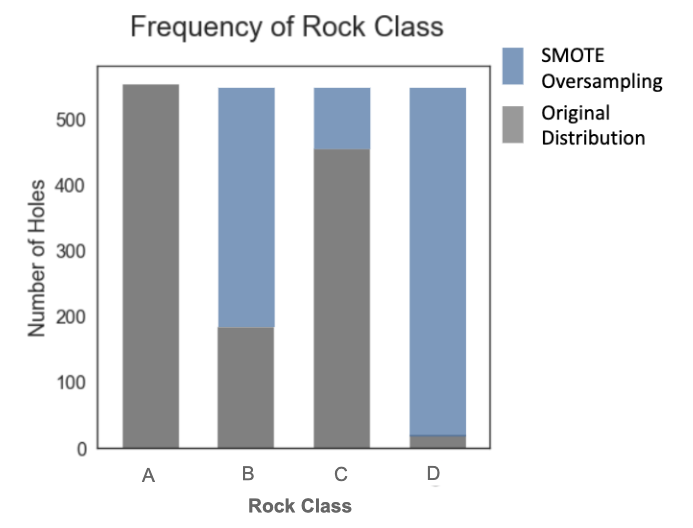
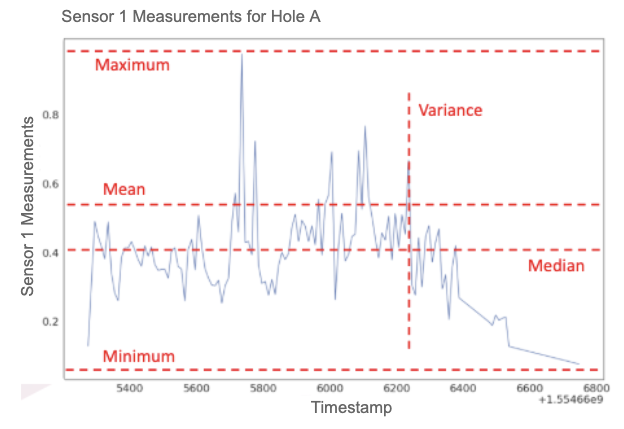

The thought of sifting through data about rocks for a solid two months might elicit a yawn from some people &mdash; these people would likely run from such a task, but me? Well, I ran straight towards it...right into my capstone project.

As part of the UBC Master of Data Science program, students complete a "capstone project" in the final two months of studies. For us, it is an exciting opportunity to apply the knowledge and skills we've learned from the classroom environment to the industry. For UBC MDS's industry partners, they get a team of data scientists in-training focused on solving a data-focused business problem of their choice for eight weeks.

When it came time to choose a partner, [Quebec Iron Ore](https://mineraiferquebec.com/?lang=en) presented a business problem I could not refuse. Based in northern Quebec, Quebec Iron Ore is an iron ore mining company looking to scale up their production with the help of automation and machine learning. Specifically, they wanted to explore the feasibility of using telemetry data collected by the sensors in their drilling equipment to predict the type of rock that was drilled. Identifying the rock type quickly and accurately is important because immediately after drilling a hole, that hole is loaded with explosives which fragment the rock surface so that valuable iron ore containing material can be extracted &mdash; however, the amount of explosives to be loaded depends on the rock type.

*Blasting phase in iron ore mining (Quebec Iron Ore 2019)*

Unfortunately, Identifying the rock type is no trivial task as it typically requires sending samples of rock powder from the drilled hole to a laboratory to perform chemical assays. This process takes time and results are received long after holes have already been loaded with explosives and blasted.

So then the big question was... *Can we leverage drill telemetry data to create a machine learning model that predicts rock type accurately and earlier in the process in order to better inform blasting decisions?*

Over the past two months, my capstone project team and I sent out to answer exactly that question.

## The Process

Based on the data we had, we recognized we had a supervised learning problem on our hands where the labels were rock types and the features would be extracted from drilling telemetry data.

At a high level, there was a general 5-step method to our madness in tackling this problem:

##### 1) Exploratory Data Analysis (EDA)
If you've ever played a card game, you know that after the cards are dealt, you take time to not only look at what you have in hand, but to try to understand the cards you've been dealt.

The same applies when faced with a new problem that involves data &mdash; it pays to first understand the data you have. So we dedicated time to explore the data samples given to us by looking at summary statistics, visualizing the data, and asking the domain experts questions where things were unclear to us.

As we did this, we also developed a better understanding of the business problem and context...and we noticed a data imbalance issue. More on this in #3.

##### 2) Data Cleaning and Integration
Before we begin to fit any model, we needed to create a solid foundation for data analysis work. Not only did this involve the joys of cleaning and joining together multiple different data sources, we needed a pipeline that could easily execute these steps and pass the intermediary results to the next steps in the process.

Our programming language of choice was Python, so we wrote our this pipeline in Python with the help of Make to the automate execution of steps in the pipeline.

At this step, we also split our data into train and test portions.

##### 3) Handle Imbalanced Data
Once we had the data joined together in the appropriate format, we got a sense of how many full observations we were working with. Based on this and a sense from our EDA earlier, we saw that one rock type had much fewer observations compared to the other classes.

This is a problem in machine learning models since the model would tend to ignore the under-represented class and favour predicting the majority classes instead. After discussing with domain experts to better understand the reason for the data imbalance, we decided to group similiar rock types into larger categories of rock "classes" and to apply an oversampling technique called "SMOTE" on the rock classes:

One reference we found useful on this topic is: [SMOTE explained for noobs](http://rikunert.com/SMOTE_explained).

##### 4) Feature Engineering
Once we had the data joined together, we needed to create features for the model. To do this, we used both summary statistics and domain expertise.

With the first approach, we calculated a set of numeric values which summarized a time series corresponding to sensor measurements for a particular hole. We calculated these for each hole/observation. The below image illustrates the idea for a given hole:

We also wanted to take advantage of domain expertise in house at Quebec Iron Ore to help us identify characteristics that would differentiate rock classes. Based on feedback elicited from an experienced drill operator, we created several features using this approach.

##### 5) Modelling
At this point, we were ready to try fitting different models. Hyperparameter selection was done using randomized cross-validation. Model performance was assessed on the cross-validated values of accuracy, macro F1 score and a custom cost function requested by the partner.

The top 5 models were selected and their performance assessed on the test data set. One final model was selected based on test performance results.

## The Solution

The main deliverable of our project was a final model that predicts the most likely rock class for a given drilled hole trained on the industry partner's data. Anticipating the future need to update the model, we also provided a Python package which easily executes a reproducible process to re-train the model using new input data.

To visualize the predictions from the model, we created a web application using [Plotly](https://plot.ly/python/) and [Dash](https://dash.plot.ly/).

If you want to learn more about our project, the code for the pipeline we developed are all open sourced and can be found on GitHub at:

[https://github.com/mfqqio/rock_predictor](https://github.com/mfqqio/rock_predictor)

## Learnings
Over the course of this project, I've learned more than I can outline, but one key learning I've taken away from the experience is:

>Unlike the monster under your bed that may or may not exist, data imbalance is a real thing and needs to be handled properly.
>
>Before selecting your technique of choice to tackle that beast (e.g. oversampling, undersampling), it's important to also drill into (pun intended) why the data is imbalanced in the first place. Is the imbalance representative of reality, or is there a systematic bias that could be corrected? Will more data be collected for the minority class in the future?
>
>If you can, talk to domain experts or your client about it and explain to them the consequence of this issue on the performance of the model. It is possible that even with your best efforts to mitigate the data imbalance, that the model performance on the minority class could still be less than ideal. Having conversations like this helps to manage expectations and make better modelling decisions.
