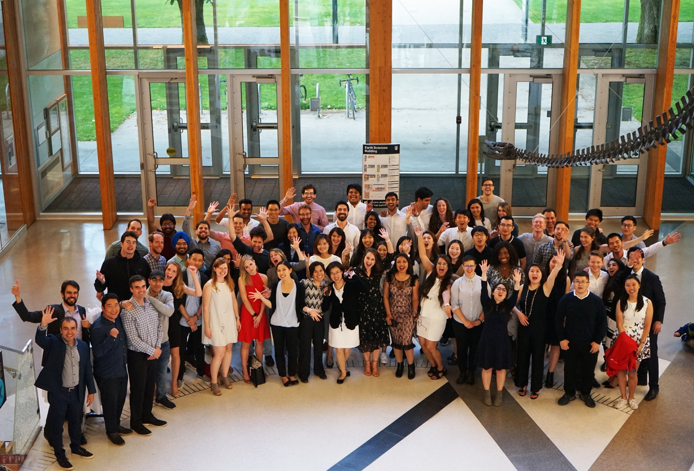

Ten months ago, I quit my job and embarked on an adventure. That adventure saw me don a backpack once again. Before you think I set off to the backcountry of Europe to recreate my own "eat pray love" moments and partake in deep soul-searching, I'll interject and say some soul-searching did happen but I was firmly planted in Vancouver (on the UBC campus, in fact) and I proudly donned a backpack...as a full-time student.

I started the [Master of Data Science program at UBC](https://masterdatascience.ubc.ca/) in September of last year. This adventure was no fanciful whim in the park, however, as it'd been something I had been planning for almost a year. Financially, professionally and even emotionally, it was a big decision for me to go back to school after working full-time for six years. It required preparation and self-reflection, but I knew it would be the right step for me. Fastforward ten months later, I've completed the program and live to tell the tale with no regrets.

*The 2018-19 UBC MDS cohort*

Near the end of my studies, I did an interview with the program to talk about my experience in MDS. The questions in that interview got me thinking about main takeaways and tips I have that could be helpful to prospective students considering or about to start the program. In this blog post, I share some of my answers to questions in those areas. Hopefully, this might be useful for some of you out there!

**What have been the top benefits of the program?**

>1) Learning a range of highly relevant material that has been carefully designed and curated into one package, taught by professors who are experts in their field.
>
>2) Being in an immersive environment where you live and breathe data science everyday, surrounded by peers who are just as motivated as you are to learn.
>
>3) The capstone project at the end of the program offers a great opportunity to apply what was learned in the classroom to real business problems faced by companies today.

**Your Top 3 tips on succeeding in the program?**

>1)  The program is fast-paced and requires that you commit to staying on top of assignments. If you were a procrastinator in school, don't fall back to these procrastinating ways! Your future self will thank you.
>
>2) Talk to your peers and instructors if you don't understand something or get stuck. Don't suffer silently! Take advantage of the resources available, including the career-related events organized specifically by the program.
>
>3) When things get hectic, this often goes out the window but don't forget to take care of yourself - eat well, exercise and get some sleep. It's hard to understand what a neural network is when your own neural network is operating on coffee and no sleep.
