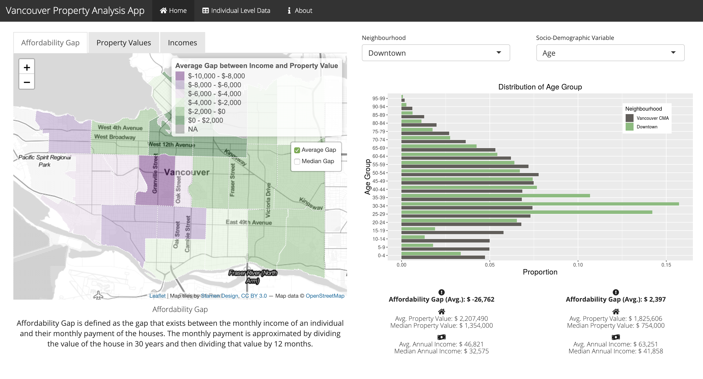

With home prices in Vancouver at record highs over recent years, many are concerned about housing affordability, especially [the gap](https://globalnews.ca/news/4444324/metro-vancouver-home-prices-incomes/) between property values and the income of people currently living in Vancouver. If we can compare property values of homes in different neighbourhoods of Vancouver and the socio-economic background of people who reside in those areas, we can identify neighbourhoods where the affordability gap is particularly severe and dig a little into why that might be the case.

To address this, my partner and I built a web application as part of a data visualization course which allows users to explore property values and socio-economic data of the different Vancouver neighbourhoods.

You can find the app [HERE](https://carrieklc.shinyapps.io/vancouver_tax/).

What kinds of noteworthy trends do you see across the city? For myself, I found it interesting that as we move from east to west, we see both property values and incomes decrease, but property value-income gaps are still largest amongst neighbourhoods in the west to mid-west. This is highlighted by Shaughnessy, where the median property value is over $5 million, yet the annual median income of people who live in that area is only $44K. Only in Vancouver, right?

The data driving the app are from the City of Vancouver's [Open Data Catalogue](https://data.vancouver.ca/datacatalogue/index.htm) (which provides a lot of other really interesting data, by the way).

More details about the app and how we approached the problem can be found in the project's [GitHub repository](https://github.com/UBC-MDS/Vancouver-Property-Value-Analysis).

The app was built using the R package, [Shiny](https://shiny.rstudio.com/). It was my first experience using Shiny and I found it a great learning experience. Although I can see some aspects being limiting if you want tighter control and more flexibility as to exactly how your web app will look, I can see myself using Shiny more in the future to quickly spin up data-driven web apps.
